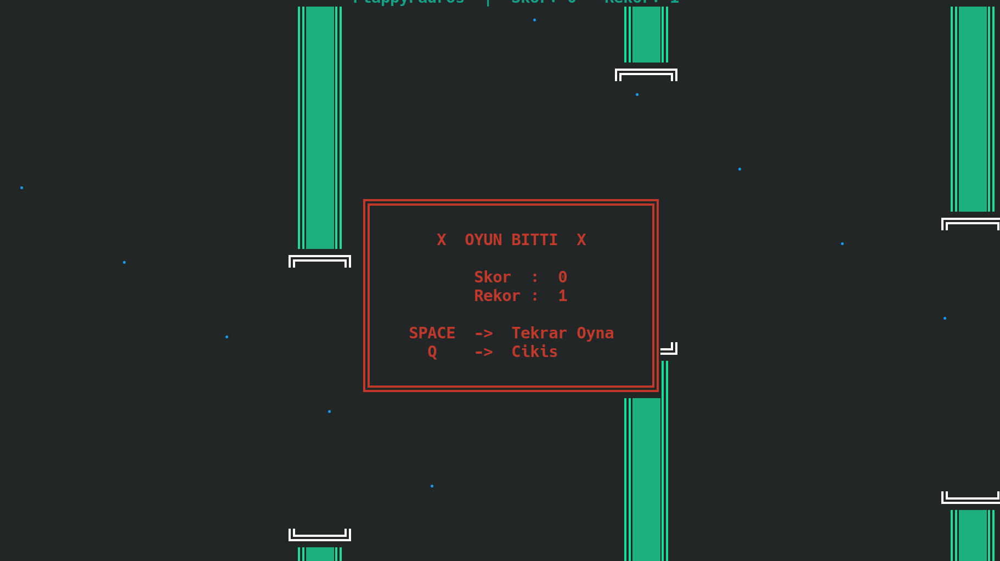

# 🐦 FlappyPadros: Terminal Edition 🚀

Selamlar maceracı! 🖖 Terminalin siyah ekranlarını sıkıcı bulanlardan mısın? O zaman kemerlerini bağla (veya kanatlarını hazırla), çünkü **FlappyPadros** ile piksellerin arasında süzülmeye geliyoruz! 🐥🌪️

Bu proje, efsanevi Flappy Bird mekaniklerini tamamen **Python** ve **Curses** kütüphanesi kullanarak terminaline taşıyor. Grafik kartına ihtiyacın yok, sadece hızlı parmaklara ihtiyacın var! ⌨️🔥

---

## ✨ Özellikler

* **Retro ASCII Grafikler:** Göz yormayan, nostalji kokan tasarım! 📺
* **Akıcı Fizik:** Yer çekimi ve zıplama hissi tam ayarında. 🧪🍎
* **Skor Takibi:** En yüksek skorun (High Score) kaydedilir, arkadaşlarına hava atabilirsin! 🏆👑
* **Dinamik Engeller:** Her seferinde rastgele oluşan borularla sonsuz döngü. 🚧🔄
* **Tamamen Hafif:** Bilgisayarın fan bile açmayacak, söz! ❄️💻

---

## 🕹️ Kontroller

Oynaması çok kolay, ustalaşması... Neyse, sen dene ve gör! 😂

| Tuş | Eylem |
| :--- | :--- |
| **SPACE** / **↑** | Zıpla (Kanat çırp!) 🐥 |
| **Q** | Korkup kaç (Çıkış) 🚪🏃‍♂️ |

---

## 🚀 Kurulum ve Çalıştırma

Bilgisayarında **Python 3** kuruluysa hazırsın demektir! 🐍

1.  Önce repoyu klonla:
    ```bash
    git clone [https://github.com/kullaniciadi/FlappyPadros.git](https://github.com/kullaniciadi/FlappyPadros.git)
    ```
2.  Klasöre gir:
    ```bash
    cd FlappyPadros
    ```
3.  Ve uçuşu başlat:
    ```bash
    python flappy_padros.py
    ```

> **⚠️ Windows Kullanıcıları İçin Not:** Windows'ta `curses` kütüphanesi standart olarak yüklü gelmez. Eğer hata alırsan şu komutla sorunu hemen çözebilirsin:
> `pip install windows-curses` 🛠️

---

## 🛠️ Teknik Detaylar (Kodun Mutfağı)

Eğer "Ben bu kuşu daha hızlı uçururum!" diyorsan, kodun başındaki sabitlerle oynayarak kendi zorluk seviyeni belirleyebilirsin:

* `GRAVITY`: Yer çekimi sertliği 🍎
* `PIPE_GAP`: Boruların arasındaki boşluk (Zorluk seviyesi!) 📏
* `FRAME_TIME`: Oyunun hızı (FPS ayarı) ⚡

---

## 📸 Ekran Görüntüsü



